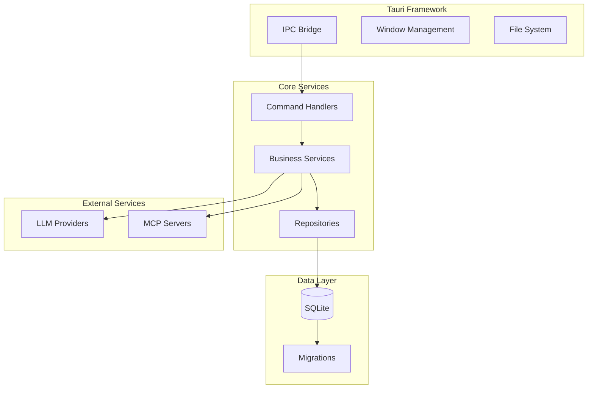

# Backend Architecture

The Nexo backend is built with Rust and Tauri, providing a secure, performant foundation for the desktop application.

## Core Components



## Application State

**Location:** `src-tauri/src/state/app_state.rs`

Global application state managed by Tauri:

```rust
pub struct AppState {
    pub chat_service: Arc<ChatService>,
    pub llm_service: Arc<LLMService>,
    pub workspace_service: Arc<WorkspaceService>,
    // ... other services
}
```

## Command System

### Command Registration

Commands are registered in `src-tauri/src/lib.rs`:

```rust
.invoke_handler(tauri::generate_handler![
    commands::chat::create_chat,
    commands::chat::send_message,
    commands::workspace::create_workspace,
    // ... other commands
])
```

### Command Constants

Command names defined in `src-tauri/src/constants/commands.rs`:

```rust
impl TauriCommands {
    pub const CREATE_CHAT: &'static str = "create_chat";
    pub const SEND_MESSAGE: &'static str = "send_message";
    // ...
}
```

These constants are used to generate TypeScript bindings.

## Service Layer

### Service Dependencies

Services receive dependencies via `AppState`:

```rust
pub struct ChatService {
    repository: Arc<dyn ChatRepository>,
    llm_service: Arc<LLMService>,
    tool_service: Arc<ToolService>,
}
```

### Service Initialization

Services are initialized in `app_state.rs`:

```rust
let chat_service = Arc::new(ChatService::new(
    chat_repository.clone(),
    llm_service.clone(),
    tool_service.clone(),
));
```

## Repository Pattern

### Trait Definition

Repositories are defined as traits:

```rust
pub trait ChatRepository: Send + Sync {
    fn create(&self, chat: &Chat) -> Result<(), AppError>;
    fn get_by_id(&self, id: &str) -> Result<Option<Chat>, AppError>;
    // ...
}
```

### Implementation

Concrete implementations use SQLite:

```rust
pub struct SqliteChatRepository {
    conn: Arc<Mutex<Connection>>,
}

impl ChatRepository for SqliteChatRepository {
    fn create(&self, chat: &Chat) -> Result<(), AppError> {
        let conn = self.conn.lock().unwrap();
        conn.execute(
            "INSERT INTO chats (id, workspace_id, title, created_at) VALUES (?1, ?2, ?3, ?4)",
            params![chat.id, chat.workspace_id, chat.title, chat.created_at],
        )?;
        Ok(())
    }
}
```

## Database

### Connection Management

Database connection managed via Tauri's state:

```rust
let db_path = app.path_resolver()
    .app_data_dir()
    .unwrap()
    .join("database.db");

let conn = Connection::open(db_path)?;
run_migrations(&conn)?;
```

### Migrations

Migrations defined in `src-tauri/src/db/migrations.rs`:

```rust
pub fn run_migrations(conn: &Connection) -> Result<()> {
    conn.execute("CREATE TABLE IF NOT EXISTS workspaces (...)", [])?;
    conn.execute("CREATE TABLE IF NOT EXISTS chats (...)", [])?;
    // ...
    Ok(())
}
```

## Event System

### Event Emission

Services emit events for real-time updates:

```rust
use crate::events::MessageEmitter;

let emitter = MessageEmitter::new(app.clone());
emitter.emit_message_chunk(chunk).await?;
```

### Event Types

Events defined in `src-tauri/src/constants/events.rs`:

```rust
impl TauriEvents {
    pub const MESSAGE_CHUNK: &'static str = "message-chunk";
    pub const MESSAGE_COMPLETE: &'static str = "message-complete";
    // ...
}
```

## Error Handling

### Error Types

Custom error types in `src-tauri/src/error.rs`:

```rust
pub enum AppError {
    Database(String),
    LLM(String),
    MCP(String),
    Validation(String),
    // ...
}
```

### Error Propagation

Errors propagate through layers:

```rust
pub async fn send_message(...) -> Result<Message, AppError> {
    let chat = self.repository.get_by_id(&chat_id)
        .map_err(|e| AppError::Database(e.to_string()))?;
    // ...
}
```

## Async Runtime

### Tokio

Tauri uses Tokio for async operations:

```rust
#[tauri::command]
pub async fn send_message(...) -> Result<Message, AppError> {
    // Async operations
}
```

### Concurrency

Services handle concurrent requests:

```rust
let mut handles = vec![];
for tool_call in tool_calls {
    let handle = tokio::spawn(async move {
        // Execute tool
    });
    handles.push(handle);
}
```

## Security

### Process Isolation

Tauri provides process isolation:

- Frontend in WebView
- Backend in separate process
- IPC for communication

### Sandboxing

File system access restricted:

- Only app data directory accessible
- User must grant permissions for other paths

### API Key Storage

API keys stored in SQLite:

- Encrypted at rest (if enabled)
- Never sent to third parties
- Local-only storage
