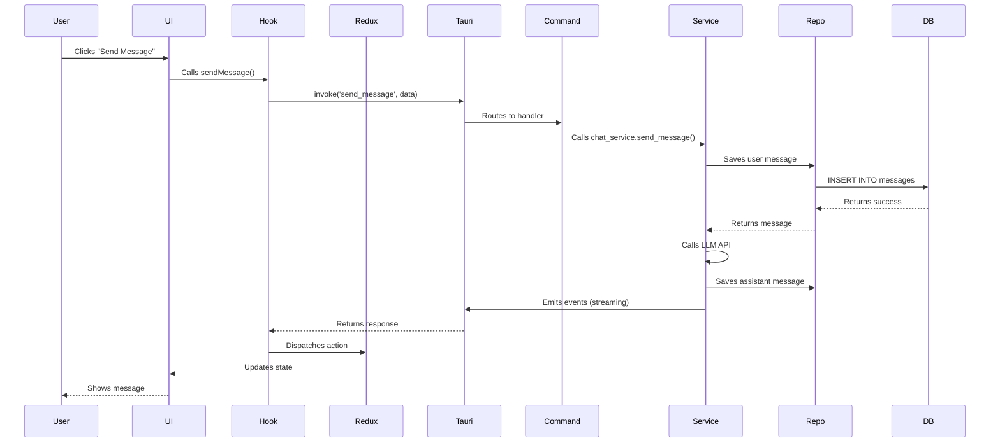
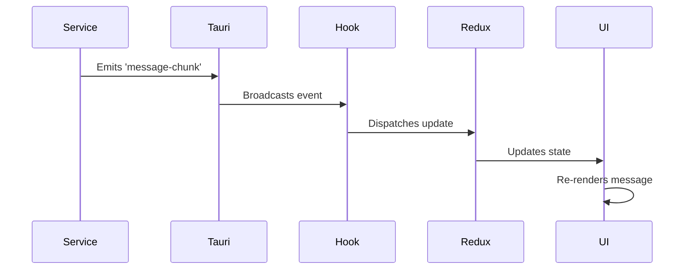

# Data Flow

Understanding how data flows through Nexo is essential for development and debugging.

## Request Flow (Frontend → Backend)



## Event Flow (Backend → Frontend)



## Message Sending Flow

### 1. User Input

User types message and clicks send:

```typescript
// UI Component
<ChatInput onSend={(content) => sendMessage(content)} />
```

### 2. Hook Processing

Hook prepares and sends request:

```typescript
// useChats hook
const sendMessage = async (content: string) => {
  const result = await invokeCommand(TauriCommands.SEND_MESSAGE, {
    chat_id: currentChatId,
    content,
  });
  dispatch(messagesSlice.actions.addMessage(result));
};
```

### 3. Command Handler

Command validates and delegates:

```rust
#[tauri::command]
pub async fn send_message(
    app: AppHandle,
    chat_id: String,
    content: String,
) -> Result<Message, AppError> {
    let state = app.state::<AppState>();
    let service = &state.chat_service;
    service.send_message(chat_id, content).await
}
```

### 4. Service Logic

Service orchestrates the operation:

```rust
impl ChatService {
    pub async fn send_message(&self, chat_id: String, content: String) -> Result<Message, AppError> {
        // 1. Save user message
        let user_message = self.message_repo.create(/* ... */)?;

        // 2. Call LLM
        let response = self.llm_service.generate(/* ... */).await?;

        // 3. Save assistant message
        let assistant_message = self.message_repo.create(/* ... */)?;

        // 4. Emit events for streaming
        self.emit_message_chunk(chunk).await?;

        Ok(assistant_message)
    }
}
```

### 5. Repository Access

Repository saves to database:

```rust
impl MessageRepository for SqliteMessageRepository {
    fn create(&self, message: &Message) -> Result<(), AppError> {
        let conn = self.conn.lock().unwrap();
        conn.execute(
            "INSERT INTO messages (id, chat_id, role, content, timestamp) VALUES (?1, ?2, ?3, ?4, ?5)",
            params![message.id, message.chat_id, message.role, message.content, message.timestamp],
        )?;
        Ok(())
    }
}
```

## Streaming Flow

### 1. Service Emits Chunks

As LLM generates response:

```rust
while let Some(chunk) = stream.next().await {
    emitter.emit_message_chunk(chunk).await?;
}
```

### 2. Frontend Listens

Hook subscribes to events:

```typescript
useEffect(() => {
  const unlisten = listen(TauriEvents.MESSAGE_CHUNK, (event) => {
    dispatch(messagesSlice.actions.appendChunk(event.payload));
  });
  return () => unlisten();
}, []);
```

### 3. UI Updates

Component re-renders with new chunks:

```typescript
const message = useAppSelector(selectCurrentMessage);
return <div>{message.content}</div>; // Updates as chunks arrive
```

## Workspace Creation Flow

### 1. User Action

User creates new workspace:

```typescript
const createWorkspace = async (name: string) => {
  const workspace = await invokeCommand(TauriCommands.CREATE_WORKSPACE, {
    name,
  });
  dispatch(workspacesSlice.actions.addWorkspace(workspace));
};
```

### 2. Backend Processing

```rust
pub async fn create_workspace(
    app: AppHandle,
    name: String,
) -> Result<Workspace, AppError> {
    let state = app.state::<AppState>();
    let service = &state.workspace_service;

    // Create workspace
    let workspace = service.create_workspace(name).await?;

    // Create default settings
    service.create_default_settings(&workspace.id).await?;

    Ok(workspace)
}
```

## State Synchronization

### Redux State

Frontend state managed by Redux:

```typescript
interface ChatsState {
  chats: Chat[];
  currentChatId: string | null;
  loading: boolean;
}
```

### Database State

Backend state in SQLite:

```sql
CREATE TABLE chats (
    id TEXT PRIMARY KEY,
    workspace_id TEXT NOT NULL,
    title TEXT NOT NULL,
    created_at INTEGER NOT NULL
);
```

### Synchronization

State kept in sync via:

- Commands update both Redux and database
- Events update Redux when backend changes
- No direct database access from frontend

## Error Flow

### 1. Error Occurs

Error in service layer:

```rust
let result = self.llm_service.generate(/* ... */).await
    .map_err(|e| AppError::LLM(e.to_string()))?;
```

### 2. Error Propagation

Error flows through layers:

```rust
Command -> Service -> Repository -> Database
```

### 3. Error Handling

Frontend handles error:

```typescript
try {
  await sendMessage(content);
} catch (error) {
  toast.error('Failed to send message');
  console.error(error);
}
```

## Tool Execution Flow

### 1. LLM Requests Tool

LLM response includes tool calls:

```json
{
  "tool_calls": [
    {
      "id": "call_123",
      "name": "get_weather",
      "arguments": { "city": "San Francisco" }
    }
  ]
}
```

### 2. Service Executes Tool

Service calls MCP server:

```rust
for tool_call in tool_calls {
    let result = self.tool_service.execute(tool_call).await?;
    emitter.emit_tool_result(result).await?;
}
```

### 3. LLM Processes Result

Tool result sent back to LLM:

```rust
let final_response = self.llm_service.generate_with_tool_result(
    tool_result
).await?;
```
