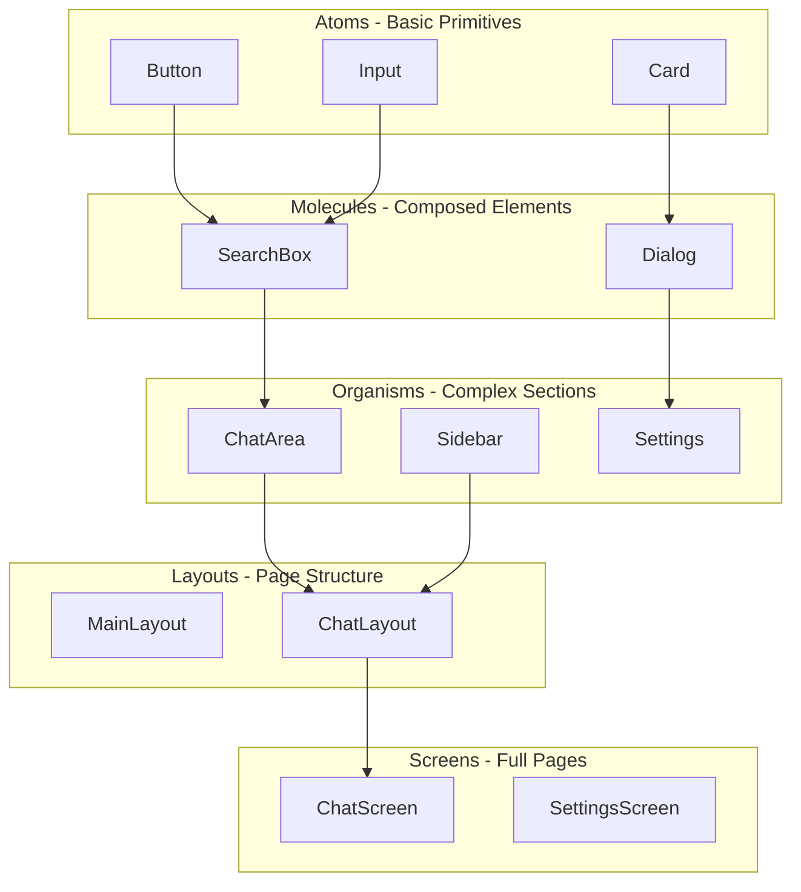

# Frontend Architecture

The Nexo frontend is built with React and follows Atomic Design principles for component organization.

## Component Structure



## Atomic Design Levels

### Atoms

**Location:** `src/ui/atoms/`

Basic UI building blocks with no business logic.

**Examples:**

- `Button` - Primary button component
- `Input` - Text input field
- `Card` - Card container
- `Dialog` - Modal dialog

**Rules:**

- No business logic
- No Tauri API calls
- No Redux usage
- Pure presentational components

### Molecules

**Location:** `src/ui/molecules/`

Composed UI elements built from atoms.

**Examples:**

- `ChatSearchDialog` - Search dialog
- `AgentMentionDropdown` - Autocomplete dropdown
- `SlashCommandDropdown` - Command autocomplete

**Rules:**

- Composed of atoms
- Minimal UI-only logic
- No Tauri API calls
- No Redux usage

### Organisms

**Location:** `src/ui/organisms/`

Complex UI sections that can use hooks and Redux.

**Examples:**

- `ChatArea` - Main chat area
- `ChatInput` - Message input
- `MessageList` - Message list
- `SettingsForm` - Settings form

**Rules:**

- Can use custom hooks
- Can use Redux
- Can call Tauri APIs via hooks
- Organized by domain (chat/, settings/, etc.)

### Layouts

**Location:** `src/ui/layouts/`

Page structure definitions.

**Examples:**

- `MainLayout` - Root layout with title bar
- `ChatLayout` - Chat page structure
- `SettingsLayout` - Settings page structure

### Screens

**Location:** `src/ui/screens/`

Full screen compositions.

**Examples:**

- `ChatScreen` - Complete chat interface
- `SettingsScreen` - Complete settings interface

## State Management

### Redux Store

**Location:** `src/store/`

**Structure:**

```
store/
├── index.ts              # Store configuration
├── hooks.ts              # Typed Redux hooks
├── slices/
│   ├── chatsSlice.ts     # Chat list state
│   ├── messages/         # Message state
│   ├── workspacesSlice.ts
│   ├── uiSlice.ts        # UI state
│   └── ...
└── types.ts              # Shared types
```

### Redux Slices

Each slice manages a specific domain:

- **chatsSlice**: Chat list, current chat
- **messagesSlice**: Messages for current chat
- **workspacesSlice**: Workspace list, current workspace
- **uiSlice**: Theme, sidebar state, dialogs
- **workspaceSettingsSlice**: Workspace settings

### Custom Hooks

**Location:** `src/hooks/`

Hooks provide a clean interface to Tauri APIs and Redux:

- `useChats` - Chat management
- `useMessages` - Message operations
- `useWorkspaces` - Workspace operations
- `useChatStreaming` - Real-time message streaming
- `useSlashCommand` - Slash command handling

**Pattern:**

```typescript
export function useChats() {
  const dispatch = useAppDispatch();
  const chats = useAppSelector(selectChats);

  const createChat = async (workspaceId: string, title: string) => {
    const result = await invokeCommand(TauriCommands.CREATE_CHAT, {
      workspace_id: workspaceId,
      title,
    });
    dispatch(chatsSlice.actions.addChat(result));
  };

  return { chats, createChat };
}
```

## Routing

Nexo uses React Router for navigation:

- `/` - Chat screen
- `/settings` - Settings screen
- `/workspace/:id/settings` - Workspace settings

## Styling

### Tailwind CSS

Utility-first CSS framework for styling.

**Configuration:** `tailwind.config.js`

**Features:**

- Responsive design utilities
- Dark mode support
- Custom color palette
- Component variants

### Component Styling

Components use Tailwind classes:

```tsx
<Button className="bg-primary text-white px-4 py-2 rounded">Click me</Button>
```

## Performance Optimizations

### Virtual Scrolling

Long lists use virtual scrolling for performance:

- Message lists
- Chat lists
- Workspace lists

### Code Splitting

Routes are code-split for faster initial load:

```typescript
const ChatScreen = lazy(() => import('./screens/ChatScreen'));
```

### Memoization

Expensive components are memoized:

```typescript
export const MessageItem = memo(({ message }: Props) => {
  // Component implementation
});
```

## Type Safety

### TypeScript

Full TypeScript coverage:

- Component props
- Redux state
- Tauri command types
- Event payloads

### Generated Types

TypeScript bindings generated from Rust:

- `src/bindings/commands.ts` - Command types
- `src/bindings/events.ts` - Event types

## Error Handling

### Error Boundaries

React error boundaries catch component errors:

```typescript
<ErrorBoundary>
  <ChatScreen />
</ErrorBoundary>
```

### Toast Notifications

User-facing errors shown via toast:

```typescript
toast.error('Failed to send message');
```
