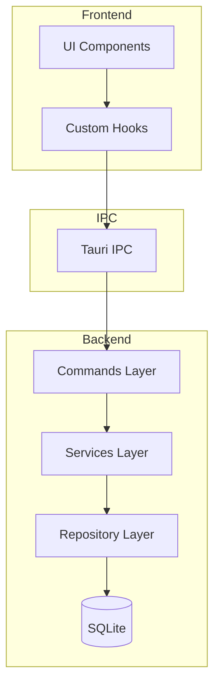

# Layered Architecture

Nexo uses a **layered architecture** with clear separation of concerns. Each layer has a specific responsibility and communicates with adjacent layers only.

## Architecture Layers



## Layer 1: Commands (API Layer)

**Location:** `src-tauri/src/commands/`

**Purpose:** Tauri command handlers that expose backend functionality to the frontend.

**Responsibilities:**

- Receive requests from frontend
- Validate input parameters
- Delegate to service layer
- Return responses or errors

**Key Commands:**

- `workspace.rs` - Workspace CRUD operations
- `chat.rs` - Chat management and message sending
- `message.rs` - Message operations
- `llm_connection.rs` - LLM provider connections
- `mcp_connection.rs` - MCP server connections
- `settings.rs` - Application and workspace settings
- `prompt.rs` - Custom prompt management
- `usage.rs` - Usage statistics

**Pattern:**

```rust
#[tauri::command]
pub async fn send_message(
    app: AppHandle,
    chat_id: String,
    content: String,
) -> Result<Response, AppError> {
    let state = app.state::<AppState>();
    let service = &state.chat_service;
    service.send_message(chat_id, content).await
}
```

## Layer 2: Services (Business Logic)

**Location:** `src-tauri/src/services/`

**Purpose:** Business logic and orchestration. Services coordinate between repositories, external APIs, and emit events.

**Responsibilities:**

- Implement business rules
- Coordinate multiple repositories
- Call external APIs (LLM providers, MCP servers)
- Emit Tauri events for real-time updates
- Handle errors and validation

**Key Services:**

- `ChatService` - Chat orchestration, LLM calls, tool execution
- `LLMService` - LLM API communication (OpenAI, Anthropic, etc.)
- `MessageService` - Message business logic
- `ToolService` - MCP tool execution
- `MCPClientService` - MCP server connections
- `WorkspaceService` - Workspace management
- `UsageService` - Token usage tracking

**Pattern:**

```rust
pub struct ChatService {
    repository: Arc<dyn ChatRepository>,
    llm_service: Arc<LLMService>,
}

impl ChatService {
    pub async fn send_message(&self, chat_id: String, content: String) -> Result<Message, AppError> {
        // 1. Validate input
        // 2. Save user message via repository
        // 3. Call LLM service
        // 4. Handle tool calls
        // 5. Emit events
    }
}
```

## Layer 3: Repositories (Data Access)

**Location:** `src-tauri/src/repositories/`

**Purpose:** Data access layer. Abstracts SQLite operations.

**Responsibilities:**

- Execute SQL queries
- Map database rows to models
- Handle database errors
- Provide type-safe data access

**Key Repositories:**

- `ChatRepository` - Chat data operations
- `MessageRepository` - Message data operations
- `WorkspaceRepository` - Workspace data operations
- `LLMConnectionRepository` - LLM connection storage
- `MCPConnectionRepository` - MCP connection storage

**Pattern:**

```rust
pub trait ChatRepository {
    fn create(&self, chat: &Chat) -> Result<(), AppError>;
    fn get_by_id(&self, id: &str) -> Result<Option<Chat>, AppError>;
    fn list_by_workspace(&self, workspace_id: &str) -> Result<Vec<Chat>, AppError>;
    fn update(&self, chat: &Chat) -> Result<(), AppError>;
    fn delete(&self, id: &str) -> Result<(), AppError>;
}
```

## Layer 4: Models (Data Structures)

**Location:** `src-tauri/src/models/`

**Purpose:** Data structures and types shared across layers.

**Key Models:**

- `Chat` - Chat session
- `Message` - Chat message
- `Workspace` - Workspace
- `LLMConnection` - LLM provider connection
- `MCPServerConnection` - MCP server connection
- `UsageStats` - Token usage statistics

## Data Flow

### Request Flow

1. **Frontend**: User action triggers hook
2. **Hook**: Calls `invokeCommand()` with Tauri command name
3. **Tauri IPC**: Routes to Rust command handler
4. **Command**: Validates input, calls service
5. **Service**: Implements business logic, calls repository
6. **Repository**: Executes SQL query
7. **Response**: Flows back through layers

### Event Flow

1. **Service**: Emits Tauri event (e.g., `message-chunk`)
2. **Tauri IPC**: Broadcasts event to frontend
3. **Hook**: Listens for event via `listen()`
4. **Redux**: Updates state with event payload
5. **UI**: Re-renders with new state

## Benefits of Layered Architecture

### Separation of Concerns

Each layer has a single, well-defined responsibility.

### Testability

Layers can be tested independently:

- Commands: Mock services
- Services: Mock repositories
- Repositories: Mock database

### Maintainability

Changes in one layer don't affect others:

- Database changes: Only affect repositories
- Business logic changes: Only affect services
- API changes: Only affect commands

### Scalability

Easy to add new features:

- New command → New service → New repository
- Clear pattern to follow

## Layer Communication Rules

### Allowed

- Commands → Services
- Services → Repositories
- Services → External APIs
- Services → Events

### Not Allowed

- Commands → Repositories (bypass services)
- Services → Commands (circular dependency)
- Repositories → Services (wrong direction)
