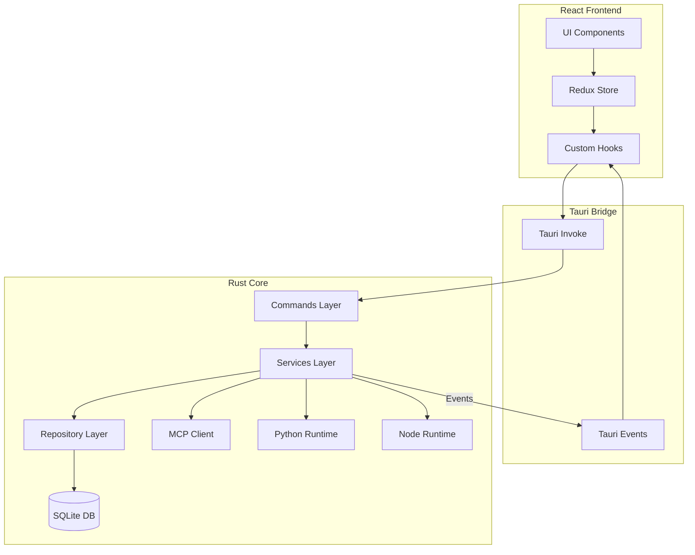
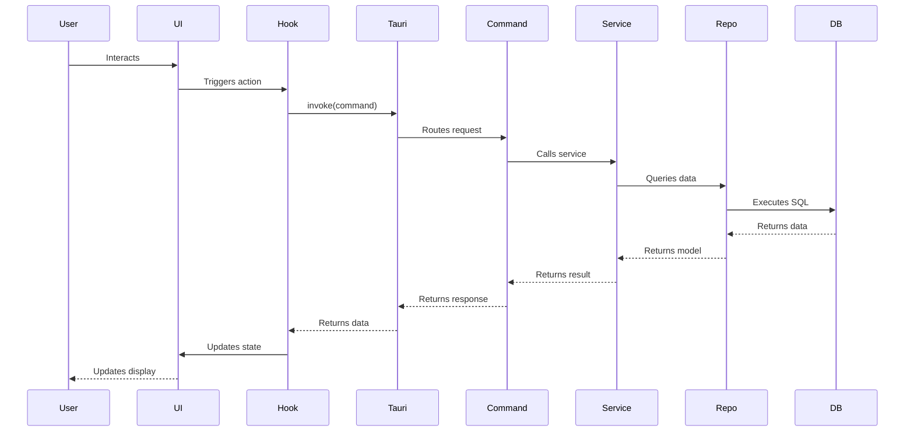

# Architecture Overview

Nexo follows a **local-first, hybrid architecture** combining a React frontend with a Rust backend, communicating via the Tauri Inter-Process Communication (IPC) bridge. The architecture emphasizes privacy, extensibility, and a clean separation of concerns.

## High-Level Architecture

## Architecture Principles

### 1. Local-First

All data is stored locally in SQLite. No cloud dependencies or external data storage.

### 2. Layered Architecture

Clear separation of concerns:

- **Commands**: API layer (Tauri command handlers)
- **Services**: Business logic layer
- **Repositories**: Data access layer

### 3. Atomic Design

Frontend components organized by complexity:

- **Atoms**: Basic UI primitives
- **Molecules**: Composed UI elements
- **Organisms**: Complex UI sections
- **Layouts**: Page layouts
- **Screens**: Complete pages

### 4. Type Safety

- TypeScript for frontend type safety
- Rust for backend type safety
- Generated TypeScript bindings from Rust constants

## Communication Flow

### Request Flow (Frontend → Backend)

1. **UI Component** triggers action
2. **Custom Hook** calls Tauri command
3. **Tauri Invoke** sends request to Rust backend
4. **Command Handler** receives request
5. **Service Layer** processes business logic
6. **Repository Layer** accesses database
7. **Response** flows back through layers

### Event Flow (Backend → Frontend)

1. **Service** emits Tauri event
2. **Tauri Event** broadcasts to frontend
3. **Custom Hook** listens for event
4. **Redux Store** updates state
5. **UI Component** re-renders

## Key Components

### Frontend

- **React 18.3.1**: UI framework
- **Redux Toolkit**: State management
- **Tailwind CSS**: Styling
- **Vite**: Build tool

### Backend

- **Tauri 2.0**: Desktop framework
- **Rust**: System programming
- **SQLite**: Local database
- **Tokio**: Async runtime

### Runtime Support

- **Pyodide**: Python execution
- **Node.js**: JavaScript execution

## Data Flow

## Security Considerations

- **Local Storage**: All data stored locally
- **API Keys**: Encrypted in database
- **No Telemetry**: No data collection
- **Sandboxed**: Tauri provides process isolation

## Performance Optimizations

- **Virtual Scrolling**: Efficient list rendering
- **Lazy Loading**: Components loaded on demand
- **Database Indexing**: Optimized queries
- **Bundle Splitting**: Reduced initial load time
