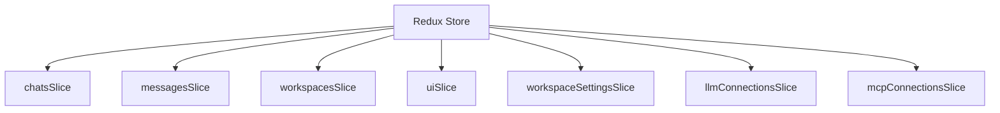

# State Management

Nexo uses Redux Toolkit for global state management, providing predictable state updates and excellent developer experience.

## Redux Store Structure



## Redux Slices

### Chats Slice

**Location:** `src/store/slices/chatsSlice.ts`

Manages chat list and current chat:

```typescript
interface ChatsState {
  chats: Chat[];
  currentChatId: string | null;
  loading: boolean;
  error: string | null;
}
```

**Actions:**

- `setChats` - Set chat list
- `addChat` - Add new chat
- `updateChat` - Update chat
- `deleteChat` - Delete chat
- `setCurrentChat` - Set current chat

### Messages Slice

**Location:** `src/store/slices/messages/`

Manages messages for current chat:

```typescript
interface MessagesState {
  messages: Record<string, Message[]>; // chatId -> messages
  streaming: boolean;
  currentChunk: string | null;
}
```

**Actions:**

- `addMessage` - Add message to chat
- `appendChunk` - Append streaming chunk
- `setStreaming` - Set streaming state
- `clearMessages` - Clear messages for chat

### Workspaces Slice

**Location:** `src/store/slices/workspacesSlice.ts`

Manages workspace list and current workspace:

```typescript
interface WorkspacesState {
  workspaces: Workspace[];
  currentWorkspaceId: string | null;
  loading: boolean;
}
```

### UI Slice

**Location:** `src/store/slices/uiSlice.ts`

Manages UI state:

```typescript
interface UIState {
  theme: 'light' | 'dark';
  sidebarOpen: boolean;
  activeDialog: string | null;
  notifications: Notification[];
}
```

## Async Actions

### Thunks

Use `createAsyncThunk` for async operations:

```typescript
export const fetchChats = createAsyncThunk(
  'chats/fetchChats',
  async (workspaceId: string) => {
    const chats = await invokeCommand(TauriCommands.LIST_CHATS, {
      workspace_id: workspaceId,
    });
    return chats;
  }
);
```

### Handling Thunks

Reducers handle thunk states:

```typescript
extraReducers: (builder) => {
  builder
    .addCase(fetchChats.pending, (state) => {
      state.loading = true;
    })
    .addCase(fetchChats.fulfilled, (state, action) => {
      state.loading = false;
      state.chats = action.payload;
    })
    .addCase(fetchChats.rejected, (state, action) => {
      state.loading = false;
      state.error = action.error.message;
    });
};
```

## Selectors

### Basic Selectors

Select specific state:

```typescript
export const selectChats = (state: RootState) => state.chats.chats;
export const selectCurrentChat = (state: RootState) => {
  const currentChatId = state.chats.currentChatId;
  return state.chats.chats.find((chat) => chat.id === currentChatId);
};
```

### Memoized Selectors

Use `createSelector` for computed values:

```typescript
export const selectChatMessages = createSelector(
  [selectMessages, selectCurrentChatId],
  (messages, chatId) => messages[chatId] || []
);
```

## Typed Hooks

### useAppDispatch

Typed dispatch hook:

```typescript
const dispatch = useAppDispatch();
dispatch(chatsSlice.actions.addChat(newChat));
```

### useAppSelector

Typed selector hook:

```typescript
const chats = useAppSelector(selectChats);
const currentChat = useAppSelector(selectCurrentChat);
```

## State Updates

### Synchronous Updates

Direct state updates:

```typescript
dispatch(chatsSlice.actions.setCurrentChat(chatId));
```

### Async Updates

Thunk-based updates:

```typescript
dispatch(fetchChats(workspaceId));
```

### Event-Based Updates

Updates from Tauri events:

```typescript
useEffect(() => {
  const unlisten = listen(TauriEvents.MESSAGE_CHUNK, (event) => {
    dispatch(messagesSlice.actions.appendChunk(event.payload));
  });
  return () => unlisten();
}, []);
```

## State Persistence

### Local Storage

Some state persisted to localStorage:

```typescript
// Load from localStorage on init
const savedTheme = localStorage.getItem('theme');
if (savedTheme) {
  dispatch(uiSlice.actions.setTheme(savedTheme));
}
```

### Database

Main state stored in SQLite:

- Chats
- Messages
- Workspaces
- Settings

## Best Practices

### 1. Keep State Normalized

Store data in normalized form:

```typescript
// Good
interface State {
  chats: Record<string, Chat>;
  messages: Record<string, Message[]>;
}

// Bad
interface State {
  chats: Chat[]; // Contains nested messages
}
```

### 2. Use Selectors

Always use selectors to access state:

```typescript
// Good
const chats = useAppSelector(selectChats);

// Bad
const chats = useAppSelector((state) => state.chats.chats);
```

### 3. Memoize Expensive Selectors

Use `createSelector` for computed values:

```typescript
const expensiveValue = useAppSelector(selectExpensiveValue);
```

### 4. Keep Slices Focused

Each slice manages one domain:

```typescript
// Good
chatsSlice - Chat management
messagesSlice - Message management

// Bad
chatSlice - Chats + Messages + Settings
```
