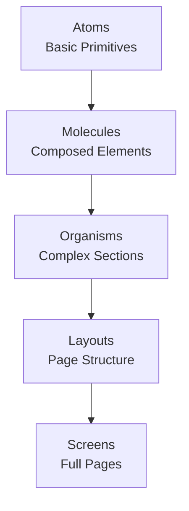

# Components Overview

Nexo's frontend follows **Atomic Design principles** for component organization. This document provides an overview of the component structure.

## Component Hierarchy



## Component Categories

### Atoms

**Location:** `src/ui/atoms/`

Basic UI building blocks with no business logic.

**Examples:**

- `Button` - Primary button component
- `Input` - Text input field
- `Card` - Card container
- `Dialog` - Modal dialog

**Rules:**

- No business logic
- No Tauri API calls
- No Redux usage
- Pure presentational

### Molecules

**Location:** `src/ui/molecules/`

Composed UI elements built from atoms.

**Examples:**

- `ChatSearchDialog` - Search dialog
- `AgentMentionDropdown` - Autocomplete dropdown
- `SlashCommandDropdown` - Command autocomplete

**Rules:**

- Composed of atoms
- Minimal UI-only logic
- No Tauri API calls

### Organisms

**Location:** `src/ui/organisms/`

Complex UI sections organized by domain.

**Domains:**

- `chat/` - Chat-related components
- `settings/` - Settings components
- `workspace/` - Workspace components
- `markdown/` - Markdown rendering

**Rules:**

- Can use hooks
- Can use Redux
- Can call Tauri APIs

### Layouts

**Location:** `src/ui/layouts/`

Page structure definitions.

**Examples:**

- `MainLayout` - Root layout with title bar
- `ChatLayout` - Chat page structure
- `SettingsLayout` - Settings page structure

### Screens

**Location:** `src/ui/screens/`

Full screen compositions.

**Examples:**

- `ChatScreen` - Complete chat interface
- `SettingsScreen` - Complete settings interface

## Component Patterns

### Presentational Components

Components that only display data:

```typescript
interface ButtonProps {
  label: string;
  onClick: () => void;
}

export function Button({ label, onClick }: ButtonProps) {
  return <button onClick={onClick}>{label}</button>;
}
```

### Container Components

Components that manage state and logic:

```typescript
export function ChatArea() {
  const { messages } = useMessages();
  const { sendMessage } = useChats();

  return (
    <div>
      {messages.map(message => (
        <MessageItem key={message.id} message={message} />
      ))}
    </div>
  );
}
```

## Styling

### Tailwind CSS

Components use Tailwind CSS for styling:

```typescript
<Button className="bg-primary text-white px-4 py-2 rounded">
  Click me
</Button>
```

### Component Variants

Use variants for different styles:

```typescript
<Button variant="primary">Primary</Button>
<Button variant="secondary">Secondary</Button>
<Button variant="danger">Danger</Button>
```

## State Management

### Local State

Use `useState` for component-local state:

```typescript
const [isOpen, setIsOpen] = useState(false);
```

### Redux State

Use Redux for global state:

```typescript
const chats = useAppSelector(selectChats);
const dispatch = useAppDispatch();
```

### Custom Hooks

Encapsulate logic in custom hooks:

```typescript
const { chats, createChat } = useChats();
```

## Best Practices

### 1. Keep Components Small

Components should have a single responsibility.

### 2. Use TypeScript

Always type component props and state.

### 3. Extract Logic

Move business logic to hooks or services.

### 4. Reuse Components

Build complex components from simpler ones.

### 5. Follow Atomic Design

Respect the component hierarchy.

## Component Documentation

For detailed component documentation, see:

- [Atoms](./atoms.md)
- [Molecules](./molecules.md)
- [Organisms](./organisms.md)
