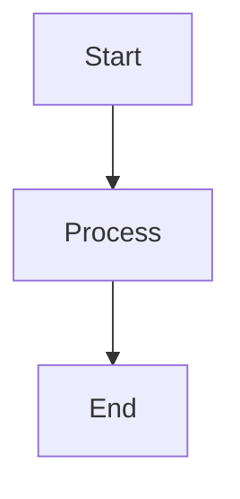

# Features

Nexo includes many powerful features to enhance your AI assistant experience.

## Chat Features

### Message Types

Nexo supports multiple message types:

- **User Messages**: Your questions and prompts
- **Assistant Messages**: AI responses
- **System Messages**: System-level instructions
- **Tool Messages**: Results from tool executions

### Markdown Support

Full markdown rendering in chat messages:

- **Headers**: `# H1`, `## H2`, etc.
- **Bold and Italic**: `**bold**`, `*italic*`
- **Code Blocks**: Syntax highlighting for multiple languages
- **Lists**: Ordered and unordered lists
- **Links**: Clickable URLs
- **Tables**: Formatted tables

### Code Execution

Run code directly in the chat:

- **Python**: Execute Python code using Pyodide
- **JavaScript**: Run JavaScript snippets
- **Output Display**: See results inline

### LaTeX Math

Render mathematical notation:

```latex
E = mc^2
```

### Mermaid Diagrams

Create diagrams in your chats:



## Advanced Features

### Thinking Mode

Some models support "thinking mode" where the AI shows its reasoning process before providing the final answer.

### Streaming Responses

Responses stream in real-time as the AI generates them, providing immediate feedback.

### Chat History

- **Persistent History**: All conversations are saved locally
- **Search**: Search through your chat history
- **Export**: Export chats as markdown files

### Keyboard Shortcuts

- `Cmd/Ctrl + N`: New chat
- `Cmd/Ctrl + ,`: Open settings
- `Cmd/Ctrl + K`: Keyboard shortcuts reference
- `Cmd/Ctrl + /`: Toggle command palette
- `Esc`: Close dialogs

## Customization

### Themes

Switch between light and dark themes:

1. Go to **Settings** → **Appearance**
2. Select your preferred theme

### System Prompts

Customize the AI's behavior with system prompts:

- Workspace-specific prompts
- Chat-specific overrides
- Prompt templates

### Custom Prompts

Save and reuse prompt templates:

1. Go to **Settings** → **Prompts**
2. Click **Add Prompt**
3. Enter your prompt template
4. Use variables: `{{variable_name}}`

## Privacy & Security

### Local-First Architecture

- All data stored locally in SQLite
- No cloud dependencies
- No telemetry or data collection

### API Key Security

- API keys stored locally
- Never sent to third parties
- Encrypted at rest (if database encryption enabled)

## Performance

### Optimizations

- Efficient message rendering
- Virtual scrolling for long chats
- Lazy loading of components
- Optimized bundle size

### Resource Usage

- Low memory footprint
- Efficient database queries
- Minimal CPU usage when idle
