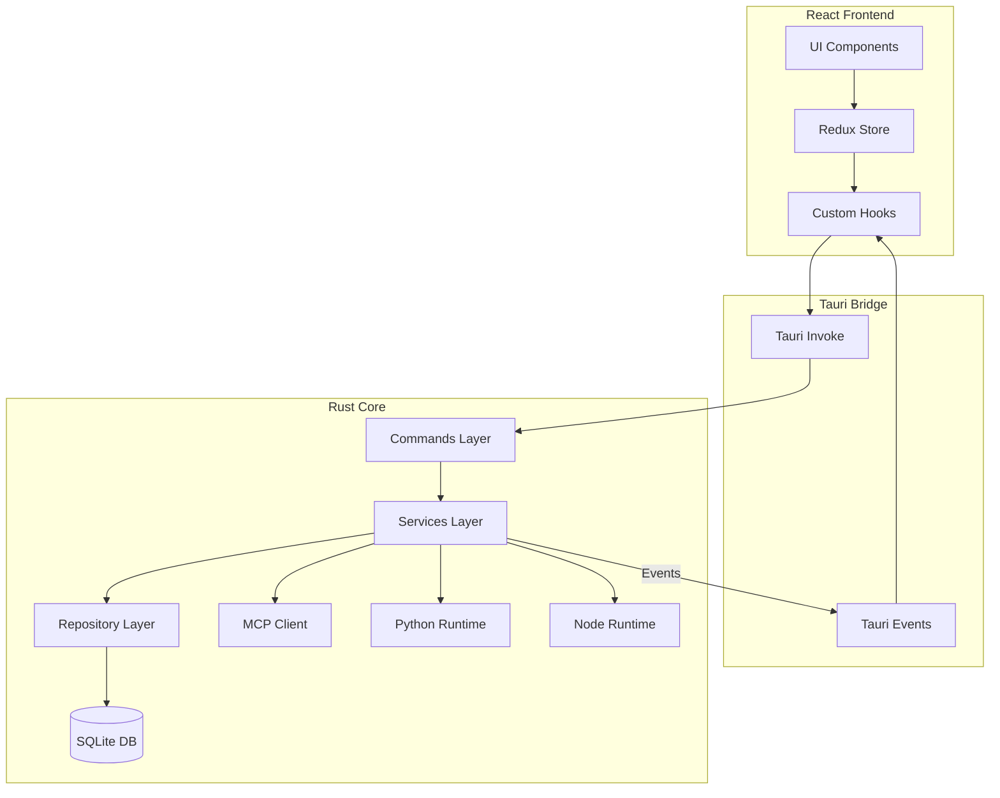

# Nexo Architecture Documentation

**Last Updated:** 2025-01-27

## Executive Summary

Nexo follows a **local-first, hybrid architecture** combining a React frontend with a Rust backend, communicating via the Tauri Inter-Process Communication (IPC) bridge. The architecture emphasizes privacy, extensibility, and a clean separation of concerns.

## High-Level Architecture



## Technology Stack

### Frontend Stack

| Category          | Technology          | Version | Purpose               |
| ----------------- | ------------------- | ------- | --------------------- |
| Framework         | React               | 18.3.1  | UI framework          |
| Language          | TypeScript          | 5.6.2   | Type safety           |
| State Management  | Redux Toolkit       | 2.11.2  | Global state          |
| UI Components     | Radix UI            | Latest  | Accessible primitives |
| Styling           | Tailwind CSS        | 4.1.18  | Utility-first CSS     |
| Build Tool        | Vite                | 6.0.3   | Build and dev server  |
| Markdown          | react-markdown      | 10.1.0  | Markdown rendering    |
| Math              | KaTeX               | 0.16.27 | LaTeX rendering       |
| Code Highlighting | Shiki, highlight.js | Latest  | Syntax highlighting   |
| Diagrams          | Mermaid             | 11.12.2 | Diagram rendering     |
| i18n              | i18next             | 25.7.3  | Internationalization  |

### Backend Stack

| Category        | Technology        | Version      | Purpose                   |
| --------------- | ----------------- | ------------ | ------------------------- |
| Framework       | Tauri             | 2.0          | Desktop app framework     |
| Language        | Rust              | Edition 2021 | System programming        |
| Database        | SQLite (rusqlite) | 0.31         | Local data storage        |
| HTTP Client     | reqwest           | 0.12         | HTTP requests to LLM APIs |
| MCP SDK         | rust-mcp-sdk      | 0.7          | Model Context Protocol    |
| Async Runtime   | Tokio             | 1.x          | Async/await support       |
| Error Tracking  | Sentry            | 0.34         | Error monitoring          |
| Type Generation | ts-rs             | 9.0          | TypeScript bindings       |

## Architecture Pattern

Nexo uses a **layered architecture** with clear separation of concerns:

### Layer 1: Commands (API Layer)

**Location:** `src-tauri/src/commands/`

**Purpose:** Tauri command handlers that expose backend functionality to the frontend.

**Key Commands:**

- `workspace.rs` - Workspace CRUD operations
- `chat.rs` - Chat management and message sending
- `message.rs` - Message operations
- `llm_connection.rs` - LLM provider connections
- `mcp_connection.rs` - MCP server connections
- `settings.rs` - Application and workspace settings
- `prompt.rs` - Custom prompt management
- `usage.rs` - Usage statistics

**Pattern:**

```rust
#[tauri::command]
pub async fn send_message(
    app: AppHandle,
    chat_id: String,
    content: String,
    // ... other params
) -> Result<Response, AppError> {
    let state = app.state::<AppState>();
    let service = &state.chat_service;
    service.send_message(/* ... */).await
}
```

### Layer 2: Services (Business Logic)

**Location:** `src-tauri/src/services/`

**Purpose:** Business logic and orchestration. Services coordinate between repositories, external APIs, and emit events.

**Key Services:**

- `ChatService` - Chat orchestration, LLM calls, tool execution
- `LLMService` - LLM API communication (OpenAI, Anthropic, etc.)
- `MessageService` - Message business logic
- `ToolService` - MCP tool execution
- `MCPClientService` - MCP server connections
- `WorkspaceService` - Workspace management
- `UsageService` - Token usage tracking

**Pattern:**

```rust
pub struct ChatService {
    repository: Arc<dyn ChatRepository>,
    llm_service: Arc<LLMService>,
    // ... other dependencies
}

impl ChatService {
    pub async fn send_message(&self, /* ... */) -> Result<Message, AppError> {
        // 1. Validate input
        // 2. Save user message via repository
        // 3. Call LLM service
        // 4. Handle tool calls
        // 5. Emit events
    }
}
```

### Layer 3: Repositories (Data Access)

**Location:** `src-tauri/src/repositories/`

**Purpose:** Data access layer. Abstracts SQLite operations.

**Key Repositories:**

- `ChatRepository` - Chat data operations
- `MessageRepository` - Message data operations
- `WorkspaceRepository` - Workspace data operations
- `LLMConnectionRepository` - LLM connection storage
- `MCPConnectionRepository` - MCP connection storage

**Pattern:**

```rust
pub trait ChatRepository {
    fn create(&self, chat: &Chat) -> Result<(), AppError>;
    fn get_by_id(&self, id: &str) -> Result<Option<Chat>, AppError>;
    // ... other methods
}
```

### Layer 4: Models (Data Structures)

**Location:** `src-tauri/src/models/`

**Purpose:** Data structures and types shared across layers.

**Key Models:**

- `Chat` - Chat session
- `Message` - Chat message
- `Workspace` - Workspace
- `LLMConnection` - LLM provider connection
- `MCPServerConnection` - MCP server connection
- `UsageStats` - Token usage statistics

## Data Flow Patterns

### 1. Request/Response (Commands)

The primary method of communication is the Frontend invoking a Backend Command.

**Flow:**

1. **User Action**: User clicks "Send Message"
2. **Frontend Hook**: `useChats` hook calls `invoke('send_message', { ... })`
3. **Tauri IPC**: Request sent to Rust backend
4. **Command Handler**: `send_message` command receives payload
5. **Service Layer**: `ChatService` validates logic, calls `LLMService`
6. **Repository Layer**: `MessageRepository` saves user message to SQLite
7. **Response**: Command returns `Result<Message, Error>` to frontend
8. **Redux Update**: Frontend updates Redux state with response

### 2. Streaming & Events

For long-running AI generation, we use Tauri events for real-time updates.

**Flow:**

1. **Frontend**: Subscribes to `message-stream` event via `useChatStreaming` hook
2. **Backend**: `LLMService` receives stream from Provider (OpenAI/Anthropic)
3. **Event Emission**: Backend emits `message-chunk` event for each chunk
4. **Frontend**: Event listener updates Redux state, re-rendering UI in real-time
5. **Completion**: `message-complete` event signals end of stream

**Event Types:**

- `message-started` - New message generation started
- `message-chunk` - Content chunk received
- `thinking-chunk` - Thinking/reasoning chunk (for thinking mode)
- `message-complete` - Message generation completed
- `message-error` - Error occurred
- `tool-calls-detected` - Tool calls found in response
- `tool-execution-started` - Tool execution began
- `tool-execution-completed` - Tool execution finished
- `agent-loop-iteration` - Agent loop iteration completed

## Frontend Architecture

### UI Component Structure (Atomic Design)

The frontend follows **Atomic Design principles**:

```
src/ui/
├── atoms/          # Basic UI primitives
│                   # - Button, Input, Select, etc.
│                   # - No business logic
│                   # - No Tauri API calls
│                   # - Pure presentational
│
├── molecules/       # Composed UI elements
│                   # - Dropdown, Dialog, SearchBox
│                   # - Composed of atoms
│                   # - Minimal UI-only logic
│
├── organisms/      # Complex UI sections
│                   # - Sidebar, MessageList, SettingsForm
│                   # - Can use hooks, Redux, local state
│                   # - Can call Tauri APIs via hooks
│                   # - Organized by domain:
│                   │   - chat/
│                   │   - settings/
│                   │   - workspace/
│                   │   - markdown/
│
├── layouts/        # Layout structure definitions
│                   # - MainLayout: Root layout with TitleBar
│                   # - SettingsLayout: Settings page structure
│                   # - ChatLayout: Chat page structure
│
└── screens/        # Full screen compositions
                    # - ChatScreen: Composes ChatLayout + ChatSidebar + ChatArea
                    # - SettingsScreen: Composes SettingsLayout + settings organisms
                    # - WorkspaceSettingsScreen: Full workspace settings view
```

**Key Rules:**

- **Atoms/Molecules**: Must NOT call Tauri APIs or use Redux directly
- **Organisms/Screens**: Can use Tauri APIs via hooks and Redux for state management
- **Separation**: Business logic lives in hooks/services, not in UI components

### State Management (Redux)

**Location:** `src/store/`

**Structure:**

- `slices/` - Redux slices (reducers + actions)
  - `chatsSlice.ts` - Chat list state
  - `messages/` - Message state (complex, with thunks)
  - `workspacesSlice.ts` - Workspace list
  - `llmConnectionsSlice.ts` - LLM connections
  - `mcpConnectionsSlice.ts` - MCP connections
  - `uiSlice.ts` - UI state (theme, sidebar, etc.)
  - `workspaceSettingsSlice.ts` - Workspace settings
  - `chatInputSlice.ts` - Chat input state
  - `notificationSlice.ts` - Notifications

**Pattern:**

```typescript
// Slice definition
const chatsSlice = createSlice({
  name: 'chats',
  initialState,
  reducers: {
    /* ... */
  },
  extraReducers: (builder) => {
    builder.addCase(fetchChats.fulfilled, (state, action) => {
      // Update state
    });
  },
});

// Async thunk
export const fetchChats = createAsyncThunk(
  'chats/fetchChats',
  async (workspaceId: string) => {
    return await invokeCommand<Chat[]>(TauriCommands.GET_CHATS, {
      workspaceId,
    });
  }
);
```

### Custom Hooks

**Location:** `src/hooks/`

**Key Hooks:**

- `useChats.ts` - Chat management
- `useMessages.ts` - Message operations
- `useChatStreaming.ts` - Event listeners for streaming
- `useWorkspaces.ts` - Workspace management
- `useAppSettings.ts` - Application settings
- `useKeyboardShortcuts.ts` - Keyboard shortcuts
- `useMenuEvents.ts` - Menu event handling

## Backend Architecture

### Database Schema

**Database:** SQLite (local-first, embedded)

**Main Tables:**

1. **workspaces**
   - `id` (TEXT PRIMARY KEY)
   - `name` (TEXT NOT NULL)
   - `created_at` (INTEGER NOT NULL)

2. **chats**
   - `id` (TEXT PRIMARY KEY)
   - `workspace_id` (TEXT NOT NULL, FOREIGN KEY)
   - `title` (TEXT NOT NULL)
   - `last_message` (TEXT)
   - `created_at` (INTEGER NOT NULL)
   - `updated_at` (INTEGER NOT NULL)
   - `agent_id` (TEXT)
   - `parent_id` (TEXT)

3. **messages**
   - `id` (TEXT PRIMARY KEY)
   - `chat_id` (TEXT NOT NULL, FOREIGN KEY)
   - `role` (TEXT NOT NULL) - 'user', 'assistant', 'system', 'tool'
   - `content` (TEXT NOT NULL)
   - `reasoning` (TEXT) - For thinking mode
   - `timestamp` (INTEGER NOT NULL)
   - `assistant_message_id` (TEXT)
   - `tool_call_id` (TEXT)
   - `metadata` (TEXT JSON)

4. **workspace_settings**
   - `workspace_id` (TEXT PRIMARY KEY, FOREIGN KEY)
   - `llm_connection_id` (TEXT)
   - `system_message` (TEXT)
   - `mcp_tool_ids` (TEXT JSON)
   - `stream_enabled` (INTEGER)
   - `default_model` (TEXT)
   - `require_tool_permission` (INTEGER)
   - `tool_permission_config` (TEXT JSON)
   - `created_at` (INTEGER NOT NULL)
   - `updated_at` (INTEGER NOT NULL)

5. **llm_connections**
   - `id` (TEXT PRIMARY KEY)
   - `name` (TEXT NOT NULL)
   - `provider` (TEXT NOT NULL)
   - `base_url` (TEXT NOT NULL)
   - `api_key` (TEXT)
   - `headers` (TEXT JSON)
   - `created_at` (INTEGER NOT NULL)
   - `updated_at` (INTEGER NOT NULL)

6. **mcp_server_connections**
   - `id` (TEXT PRIMARY KEY)
   - `name` (TEXT NOT NULL)
   - `url` (TEXT NOT NULL)
   - `type` (TEXT NOT NULL) - 'sse', 'stdio', 'http-streamable'
   - `headers` (TEXT NOT NULL JSON)
   - `status` (TEXT NOT NULL) - 'connected', 'disconnected'
   - `tools_json` (TEXT JSON)
   - `error_message` (TEXT)
   - `runtime_path` (TEXT)
   - `created_at` (INTEGER NOT NULL)
   - `updated_at` (INTEGER NOT NULL)

7. **app_settings**
   - `key` (TEXT PRIMARY KEY)
   - `value` (TEXT NOT NULL)
   - `updated_at` (INTEGER NOT NULL)

8. **prompts**
   - `id` (TEXT PRIMARY KEY)
   - `name` (TEXT NOT NULL)
   - `content` (TEXT NOT NULL)
   - `created_at` (INTEGER NOT NULL)
   - `updated_at` (INTEGER NOT NULL)

9. **usage_stats**
   - `id` (TEXT PRIMARY KEY)
   - `workspace_id` (TEXT NOT NULL)
   - `chat_id` (TEXT NOT NULL)
   - `message_id` (TEXT NOT NULL)
   - `provider` (TEXT NOT NULL)
   - `model` (TEXT NOT NULL)
   - `input_tokens` (INTEGER DEFAULT 0)
   - `output_tokens` (INTEGER DEFAULT 0)
   - `total_tokens` (INTEGER DEFAULT 0)
   - `latency_ms` (INTEGER DEFAULT 0)
   - `cost` (REAL DEFAULT 0.0)
   - `timestamp` (INTEGER NOT NULL)
   - `is_stream` (INTEGER DEFAULT 0)
   - `status` (TEXT DEFAULT 'success')
   - `request_type` (TEXT)

**Indexes:**

- `idx_chats_workspace_id` on `chats(workspace_id)`
- `idx_messages_chat_id` on `messages(chat_id)`
- `idx_messages_timestamp` on `messages(timestamp)`
- `idx_usage_stats_workspace_id` on `usage_stats(workspace_id)`
- `idx_usage_stats_timestamp` on `usage_stats(timestamp)`
- `idx_chats_parent_id` on `chats(parent_id)`

### MCP Integration

**Purpose:** Model Context Protocol (MCP) allows connecting to external tools and services.

**Flow:**

1. User configures MCP server connection (URL, type, headers)
2. Backend connects to MCP server via `MCPClientService`
3. Tools are discovered and stored in `mcp_server_connections.tools_json`
4. When LLM requests a tool, `ToolService` executes it via MCP client
5. Tool results are returned to LLM for continued generation

**Supported Transport Types:**

- `sse` - Server-Sent Events
- `stdio` - Standard input/output
- `http-streamable` - HTTP streaming

### Python/Node Runtime

**Purpose:** Execute Python and Node.js code in chat messages.

**Implementation:**

- Python: Uses Pyodide (WebAssembly Python runtime)
- Node.js: Executes via Node.js runtime managed by backend

**Flow:**

1. User includes code block with language tag (`python` or `javascript`)
2. Frontend detects code block and shows "Run" button
3. On click, code is sent to backend via Tauri command
4. Backend executes code in appropriate runtime
5. Results are returned and displayed in chat

## Security & Privacy

### Data Storage

- All data stored locally in SQLite database
- Database location: OS app data directory
- No cloud synchronization
- No telemetry or data collection

### API Keys

- LLM API keys stored encrypted in SQLite
- Never sent to third parties except LLM providers
- User controls all API keys

### Sandboxing

- Tauri provides OS-level sandboxing
- File access restricted to user-approved paths
- Runtime execution (Python/Node) runs in isolated contexts

## Error Handling

### Frontend

- Error boundaries for React components
- Redux error states
- User-friendly error messages
- Sentry integration for production error tracking

### Backend

- Custom `AppError` type
- Result types for all operations
- Sentry integration for error reporting
- Graceful degradation

## Testing Strategy

### Frontend

- Unit tests for utilities and hooks
- Component tests with React Testing Library
- Integration tests for Redux slices

### Backend

- Unit tests for services and repositories
- Integration tests for database operations
- E2E tests for critical flows

## Performance Considerations

### Frontend

- Code splitting with Vite
- Lazy loading for heavy components
- Virtual scrolling for long message lists
- Memoization for expensive computations

### Backend

- Database indexes for common queries
- Connection pooling for SQLite
- Async/await for I/O operations
- Streaming for large responses

## Deployment Architecture

### Build Process

1. Frontend: Vite builds React app to `dist/`
2. Backend: Cargo builds Rust binary
3. Tauri: Bundles frontend + backend into native app

### Platform-Specific

- **macOS**: `.dmg` installer, code signing support
- **Windows**: `.msi` installer, WebView2 bundled
- **Linux**: `.deb` and `.AppImage` packages

---

_Documentation generated by BMAD Method `document-project` workflow_
