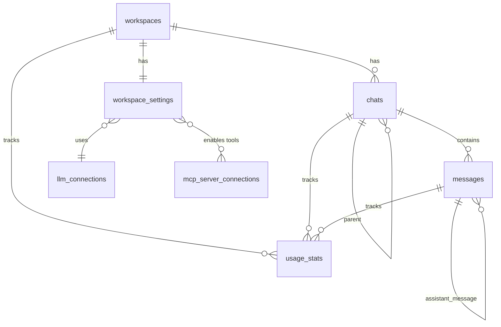

# Data Models Documentation

**Last Updated:** 2025-01-27

## Database Overview

**Type:** SQLite (local-first, embedded)  
**Location:** OS app data directory  
**Migration System:** Manual migrations in `src-tauri/src/db/migrations.rs`

## Schema Documentation

### workspaces

Workspace management - top-level organization unit for chats.

| Column       | Type    | Constraints | Description                        |
| ------------ | ------- | ----------- | ---------------------------------- |
| `id`         | TEXT    | PRIMARY KEY | Unique workspace identifier (UUID) |
| `name`       | TEXT    | NOT NULL    | Workspace display name             |
| `created_at` | INTEGER | NOT NULL    | Unix timestamp of creation         |

**Indexes:** None

**Relationships:**

- One-to-many with `chats` (via `chats.workspace_id`)
- One-to-one with `workspace_settings` (via `workspace_settings.workspace_id`)

**Rust Model:** `src-tauri/src/models/workspace.rs`

### chats

Chat sessions within a workspace.

| Column         | Type    | Constraints               | Description                    |
| -------------- | ------- | ------------------------- | ------------------------------ |
| `id`           | TEXT    | PRIMARY KEY               | Unique chat identifier (UUID)  |
| `workspace_id` | TEXT    | NOT NULL, FK → workspaces | Parent workspace               |
| `title`        | TEXT    | NOT NULL                  | Chat title                     |
| `last_message` | TEXT    |                           | Last message preview           |
| `created_at`   | INTEGER | NOT NULL                  | Unix timestamp of creation     |
| `updated_at`   | INTEGER | NOT NULL                  | Unix timestamp of last update  |
| `agent_id`     | TEXT    |                           | Associated agent identifier    |
| `parent_id`    | TEXT    |                           | Parent chat (for chat threads) |

**Indexes:**

- `idx_chats_workspace_id` on `workspace_id`
- `idx_chats_parent_id` on `parent_id`

**Relationships:**

- Many-to-one with `workspaces` (via `workspace_id`)
- One-to-many with `messages` (via `messages.chat_id`)
- Self-referential (via `parent_id` for chat threads)

**Rust Model:** `src-tauri/src/models/chat.rs`

### messages

Chat messages - user, assistant, system, and tool messages.

| Column                 | Type    | Constraints          | Description                                         |
| ---------------------- | ------- | -------------------- | --------------------------------------------------- |
| `id`                   | TEXT    | PRIMARY KEY          | Unique message identifier (UUID)                    |
| `chat_id`              | TEXT    | NOT NULL, FK → chats | Parent chat                                         |
| `role`                 | TEXT    | NOT NULL             | Message role: 'user', 'assistant', 'system', 'tool' |
| `content`              | TEXT    | NOT NULL             | Message content (markdown)                          |
| `reasoning`            | TEXT    |                      | Thinking/reasoning content (for thinking mode)      |
| `timestamp`            | INTEGER | NOT NULL             | Unix timestamp                                      |
| `assistant_message_id` | TEXT    |                      | Associated assistant message (for tool calls)       |
| `tool_call_id`         | TEXT    |                      | Tool call identifier                                |
| `metadata`             | TEXT    |                      | JSON metadata (model, tokens, etc.)                 |

**Indexes:**

- `idx_messages_chat_id` on `chat_id`
- `idx_messages_timestamp` on `timestamp`

**Relationships:**

- Many-to-one with `chats` (via `chat_id`)
- Self-referential (via `assistant_message_id` for tool call chains)

**Rust Model:** `src-tauri/src/models/message.rs`

**Metadata JSON Structure:**

```json
{
  "model": "gpt-4",
  "provider": "openai",
  "input_tokens": 100,
  "output_tokens": 200,
  "total_tokens": 300,
  "cost": 0.01,
  "latency_ms": 1500
}
```

### workspace_settings

Workspace-specific configuration and settings.

| Column                    | Type    | Constraints                  | Description                                    |
| ------------------------- | ------- | ---------------------------- | ---------------------------------------------- |
| `workspace_id`            | TEXT    | PRIMARY KEY, FK → workspaces | Workspace identifier                           |
| `llm_connection_id`       | TEXT    |                              | Default LLM connection                         |
| `system_message`          | TEXT    |                              | System prompt for this workspace               |
| `mcp_tool_ids`            | TEXT    |                              | JSON array of enabled MCP tool IDs             |
| `stream_enabled`          | INTEGER |                              | Whether streaming is enabled (0/1)             |
| `default_model`           | TEXT    |                              | Default model identifier                       |
| `require_tool_permission` | INTEGER |                              | Require permission before tool execution (0/1) |
| `tool_permission_config`  | TEXT    |                              | JSON tool permission configuration             |
| `created_at`              | INTEGER | NOT NULL                     | Unix timestamp of creation                     |
| `updated_at`              | INTEGER | NOT NULL                     | Unix timestamp of last update                  |

**Indexes:** None

**Relationships:**

- One-to-one with `workspaces` (via `workspace_id`)

**Rust Model:** `src-tauri/src/models/workspace_settings.rs`

**mcp_tool_ids JSON Structure:**

```json
["tool-id-1", "tool-id-2"]
```

**tool_permission_config JSON Structure:**

```json
{
  "default": "ask",
  "tools": {
    "tool-id-1": "allow",
    "tool-id-2": "deny"
  }
}
```

### llm_connections

LLM provider connection configurations.

| Column       | Type    | Constraints | Description                                                    |
| ------------ | ------- | ----------- | -------------------------------------------------------------- |
| `id`         | TEXT    | PRIMARY KEY | Unique connection identifier (UUID)                            |
| `name`       | TEXT    | NOT NULL    | Connection display name                                        |
| `provider`   | TEXT    | NOT NULL    | Provider type: 'openai', 'anthropic', 'google', 'ollama', etc. |
| `base_url`   | TEXT    | NOT NULL    | API base URL                                                   |
| `api_key`    | TEXT    |             | API key (encrypted in storage)                                 |
| `headers`    | TEXT    |             | JSON object of custom headers                                  |
| `created_at` | INTEGER | NOT NULL    | Unix timestamp of creation                                     |
| `updated_at` | INTEGER | NOT NULL    | Unix timestamp of last update                                  |

**Indexes:** None

**Relationships:**

- Referenced by `workspace_settings.llm_connection_id`

**Rust Model:** `src-tauri/src/models/llm_connection.rs`

**headers JSON Structure:**

```json
{
  "X-Custom-Header": "value"
}
```

### mcp_server_connections

MCP (Model Context Protocol) server connection configurations.

| Column          | Type    | Constraints | Description                                        |
| --------------- | ------- | ----------- | -------------------------------------------------- |
| `id`            | TEXT    | PRIMARY KEY | Unique connection identifier (UUID)                |
| `name`          | TEXT    | NOT NULL    | Connection display name                            |
| `url`           | TEXT    | NOT NULL    | MCP server URL or command                          |
| `type`          | TEXT    | NOT NULL    | Transport type: 'sse', 'stdio', 'http-streamable'  |
| `headers`       | TEXT    | NOT NULL    | JSON object of headers (for HTTP-based transports) |
| `status`        | TEXT    | NOT NULL    | Connection status: 'connected', 'disconnected'     |
| `tools_json`    | TEXT    |             | JSON array of available tools                      |
| `error_message` | TEXT    |             | Last error message (if disconnected)               |
| `runtime_path`  | TEXT    |             | Path to runtime executable (for stdio)             |
| `created_at`    | INTEGER | NOT NULL    | Unix timestamp of creation                         |
| `updated_at`    | INTEGER | NOT NULL    | Unix timestamp of last update                      |

**Indexes:** None

**Relationships:**

- Tool IDs referenced in `workspace_settings.mcp_tool_ids`

**Rust Model:** `src-tauri/src/models/mcp_connection.rs`

**tools_json Structure:**

```json
[
  {
    "name": "tool-name",
    "description": "Tool description",
    "inputSchema": {
      "type": "object",
      "properties": {
        "param": {
          "type": "string"
        }
      }
    }
  }
]
```

### app_settings

Application-wide settings (key-value store).

| Column       | Type    | Constraints | Description                             |
| ------------ | ------- | ----------- | --------------------------------------- |
| `key`        | TEXT    | PRIMARY KEY | Setting key                             |
| `value`      | TEXT    | NOT NULL    | Setting value (JSON for complex values) |
| `updated_at` | INTEGER | NOT NULL    | Unix timestamp of last update           |

**Indexes:** None

**Common Keys:**

- `theme` - UI theme preference
- `language` - UI language preference
- `sidebar_open` - Sidebar visibility state
- `first_launch` - First launch flag

**Rust Model:** `src-tauri/src/models/app_setting.rs`

### prompts

Custom prompt templates.

| Column       | Type    | Constraints | Description                     |
| ------------ | ------- | ----------- | ------------------------------- |
| `id`         | TEXT    | PRIMARY KEY | Unique prompt identifier (UUID) |
| `name`       | TEXT    | NOT NULL    | Prompt name                     |
| `content`    | TEXT    | NOT NULL    | Prompt content                  |
| `created_at` | INTEGER | NOT NULL    | Unix timestamp of creation      |
| `updated_at` | INTEGER | NOT NULL    | Unix timestamp of last update   |

**Indexes:** None

**Rust Model:** `src-tauri/src/models/prompt.rs`

### usage_stats

Token usage and cost tracking per message.

| Column          | Type    | Constraints       | Description                                |
| --------------- | ------- | ----------------- | ------------------------------------------ |
| `id`            | TEXT    | PRIMARY KEY       | Unique usage record identifier (UUID)      |
| `workspace_id`  | TEXT    | NOT NULL          | Workspace identifier                       |
| `chat_id`       | TEXT    | NOT NULL          | Chat identifier                            |
| `message_id`    | TEXT    | NOT NULL          | Message identifier                         |
| `provider`      | TEXT    | NOT NULL          | LLM provider name                          |
| `model`         | TEXT    | NOT NULL          | Model identifier                           |
| `input_tokens`  | INTEGER | DEFAULT 0         | Input token count                          |
| `output_tokens` | INTEGER | DEFAULT 0         | Output token count                         |
| `total_tokens`  | INTEGER | DEFAULT 0         | Total token count                          |
| `latency_ms`    | INTEGER | DEFAULT 0         | Request latency in milliseconds            |
| `cost`          | REAL    | DEFAULT 0.0       | Estimated cost                             |
| `timestamp`     | INTEGER | NOT NULL          | Unix timestamp                             |
| `is_stream`     | INTEGER | DEFAULT 0         | Whether this was a streaming request (0/1) |
| `status`        | TEXT    | DEFAULT 'success' | Request status: 'success', 'error'         |
| `request_type`  | TEXT    |                   | Request type: 'chat', 'completion', etc.   |

**Indexes:**

- `idx_usage_stats_workspace_id` on `workspace_id`
- `idx_usage_stats_timestamp` on `timestamp`

**Relationships:**

- Many-to-one with `workspaces` (via `workspace_id`)
- Many-to-one with `chats` (via `chat_id`)
- Many-to-one with `messages` (via `message_id`)

**Rust Model:** `src-tauri/src/models/usage.rs`

## Entity Relationships



## Data Access Patterns

### Repository Pattern

All database access goes through repository traits:

```rust
pub trait ChatRepository {
    fn create(&self, chat: &Chat) -> Result<(), AppError>;
    fn get_by_id(&self, id: &str) -> Result<Option<Chat>, AppError>;
    fn get_by_workspace_id(&self, workspace_id: &str) -> Result<Vec<Chat>, AppError>;
    fn update(&self, chat: &Chat) -> Result<(), AppError>;
    fn delete(&self, id: &str) -> Result<(), AppError>;
}
```

### Foreign Key Constraints

All foreign keys use `ON DELETE CASCADE`:

- Deleting a workspace deletes all its chats
- Deleting a chat deletes all its messages
- Deleting a workspace deletes its settings

### Migration Strategy

Migrations are defined in `src-tauri/src/db/migrations.rs` and run automatically on app startup. The migration system:

- Creates tables if they don't exist
- Adds columns if they don't exist (for schema evolution)
- Creates indexes
- Seeds default data (e.g., default workspace)

## Data Validation

### Frontend Validation

- TypeScript types ensure type safety
- Zod schemas for runtime validation (where used)

### Backend Validation

- Rust types ensure compile-time safety
- Repository methods validate data before persistence
- Foreign key constraints enforce referential integrity

## Performance Considerations

### Indexes

- Indexes on foreign keys (`workspace_id`, `chat_id`)
- Indexes on frequently queried columns (`timestamp`)
- Composite indexes where appropriate

### Query Optimization

- Use prepared statements (via rusqlite)
- Batch operations where possible
- Limit result sets with pagination

---

_Documentation generated by BMAD Method `document-project` workflow_
