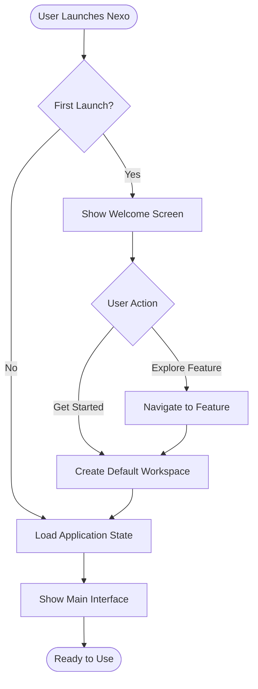
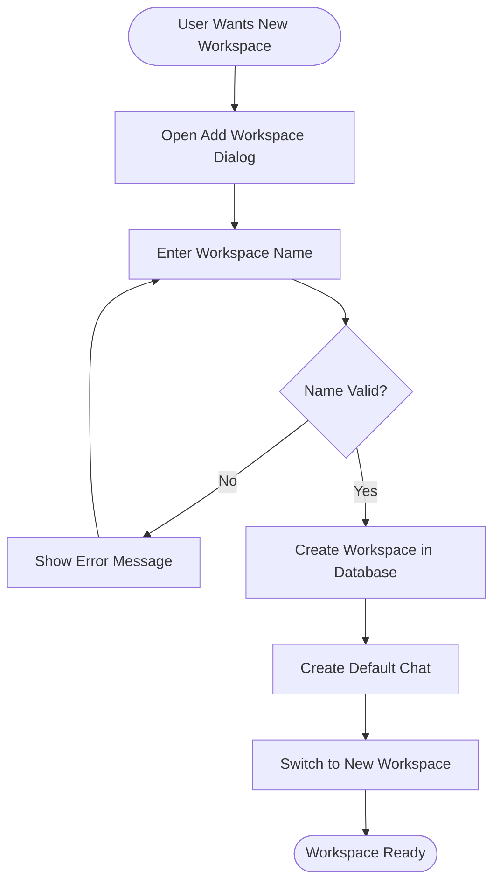
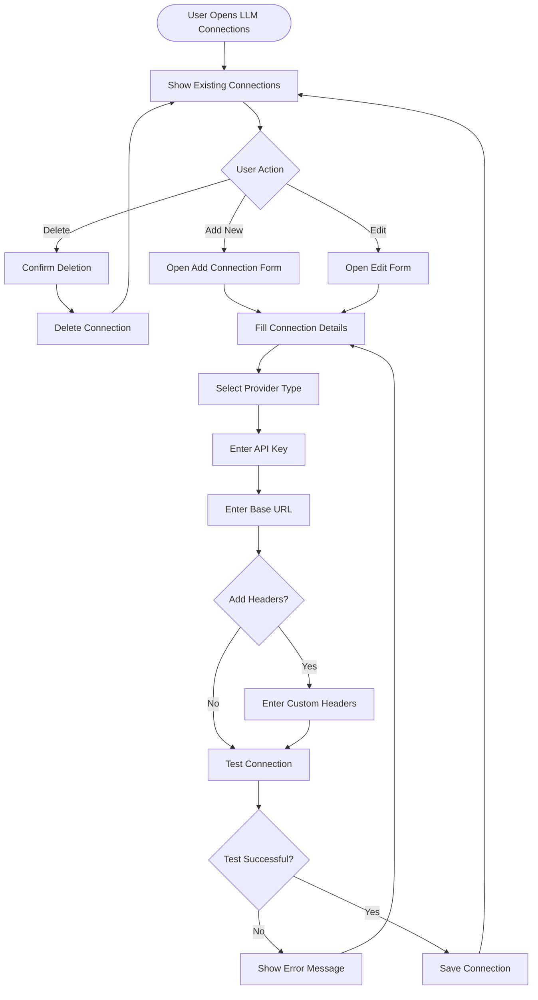
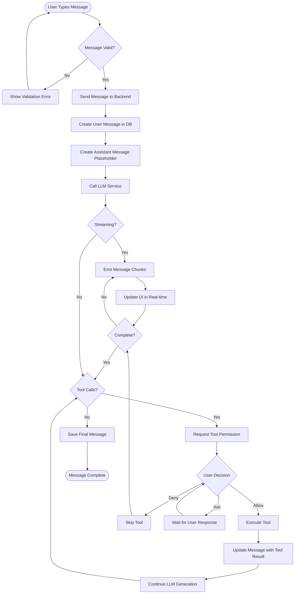
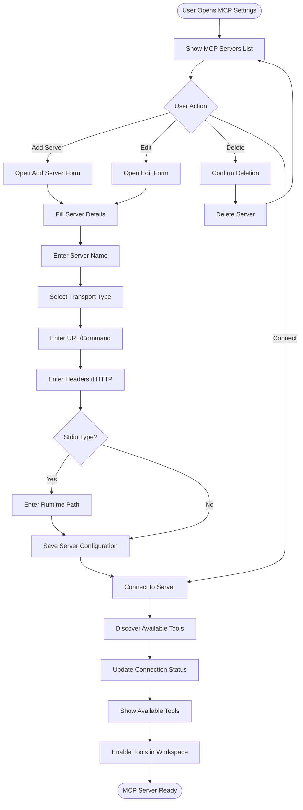
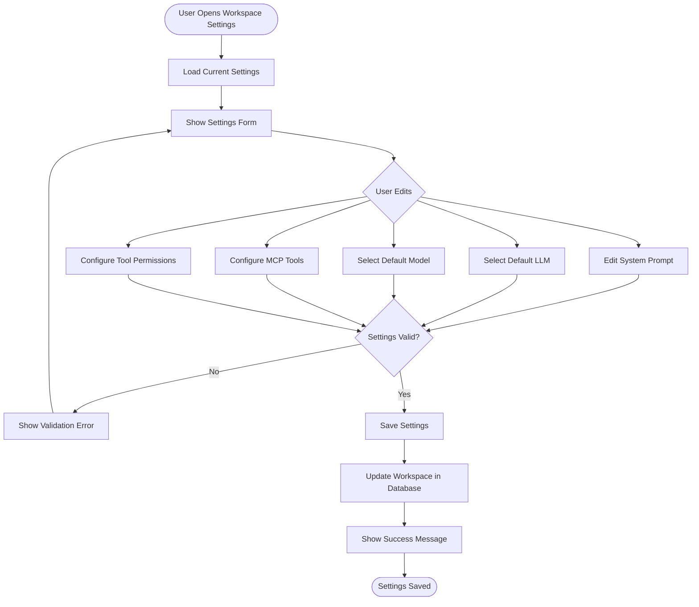

# Nexo User Flows

**Last Updated:** 2025-01-27

## Overview

This document describes the detailed user flows for all major features in Nexo. Each flow includes step-by-step instructions, decision points, and expected outcomes.

## Flow Diagrams

### Application Initialization Flow

### Workspace Creation Flow

### LLM Connection Setup Flow

### Chat Message Flow

### MCP Server Connection Flow

### Workspace Settings Configuration Flow

## Detailed Step-by-Step Flows

### Flow 1: First-Time User Onboarding

**Objective:** Guide new user through initial setup

**Steps:**

1. **Application Launch**
   - User opens Nexo application
   - System checks if first launch (`hasSeenWelcome` setting)
   - If first launch, show Welcome Screen
   - If not first launch, load main interface

2. **Welcome Screen Interaction**
   - User sees welcome screen with feature overview
   - Options:
     - Click "Get Started" → Proceed to workspace creation
     - Click feature card → Navigate to that feature's settings
   - System saves `hasSeenWelcome = true`

3. **Workspace Creation (if needed)**
   - If no workspaces exist, create default workspace
   - If workspaces exist, use existing workspace
   - System creates default chat in workspace

4. **LLM Connection Setup (if needed)**
   - If no LLM connections exist, prompt user to add one
   - User navigates to Settings → LLM Connections
   - User adds first LLM connection
   - System tests connection
   - If successful, connection is saved

5. **First Chat**
   - User sees chat interface
   - User types first message
   - System sends message to LLM
   - System displays response
   - Onboarding complete

**Success Criteria:**

- User can send and receive messages
- User understands basic interface
- User has at least one workspace and LLM connection

### Flow 2: Sending a Message with Tool Execution

**Objective:** Send message that triggers tool execution

**Steps:**

1. **User Input**
   - User types message in chat input
   - Message may implicitly or explicitly request tool usage
   - User presses Enter or clicks Send

2. **Message Processing**
   - Frontend validates input
   - Frontend calls `send_message` Tauri command
   - Backend creates user message in database
   - Backend creates assistant message placeholder

3. **LLM Call**
   - Backend calls LLM service with:
     - User message
     - Chat history
     - System prompt
     - Available tools (if MCP enabled)
   - LLM processes request

4. **Streaming Response**
   - LLM returns streaming response
   - Backend emits `message-chunk` events
   - Frontend updates UI in real-time
   - User sees response being generated

5. **Tool Call Detection**
   - LLM response includes tool call requests
   - Backend detects tool calls
   - Backend emits `tool-calls-detected` event
   - Frontend shows tool call UI

6. **Permission Check**
   - If workspace requires tool permission:
     - Backend emits `tool-permission-request` event
     - Frontend shows permission dialog
     - User chooses: Allow / Deny / Ask
   - If workspace allows all tools:
     - Proceed to execution

7. **Tool Execution**
   - Backend executes tool via MCP client
   - Backend emits `tool-execution-started` event
   - Tool executes and returns result
   - Backend emits `tool-execution-completed` event
   - Backend updates message with tool result

8. **Continued Generation**
   - Backend sends tool result to LLM
   - LLM continues generation with tool context
   - Process repeats if more tool calls needed
   - Final response is saved

9. **Completion**
   - Backend emits `message-complete` event
   - Frontend updates UI with final message
   - Message is saved to database
   - Usage statistics are recorded

**Success Criteria:**

- Message is sent successfully
- Tool is executed correctly
- Response includes tool results
- User sees complete conversation

### Flow 3: Creating and Using Custom Prompt

**Objective:** Create prompt template and use in workspace

**Steps:**

1. **Navigate to Prompts**
   - User opens Settings
   - User navigates to Prompts section
   - User sees list of existing prompts

2. **Create New Prompt**
   - User clicks "Create Prompt" button
   - User sees prompt creation form
   - User enters:
     - Prompt name (e.g., "Technical Writer")
     - Prompt content (detailed instructions)
   - User clicks "Save"

3. **Prompt Saved**
   - System saves prompt to database
   - Prompt appears in prompts list
   - User can edit or delete prompt

4. **Use Prompt in Workspace**
   - User navigates to Workspace Settings
   - User opens System Prompt field
   - User copies prompt content (or references it)
   - User pastes into system prompt field
   - User saves workspace settings

5. **Use in Chat**
   - User starts new chat in workspace
   - System uses custom prompt as system message
   - AI behavior matches prompt description
   - User gets consistent AI personality

**Success Criteria:**

- Prompt is created and saved
- Prompt can be used in workspace
- AI behavior matches prompt
- Prompt is reusable

### Flow 4: Multi-Workspace Workflow

**Objective:** Use multiple workspaces for different projects

**Steps:**

1. **Create Additional Workspaces**
   - User clicks workspace selector
   - User clicks "Add Workspace"
   - User creates "Coding" workspace
   - User creates "Writing" workspace
   - User creates "Research" workspace

2. **Configure Each Workspace**
   - **Coding Workspace:**
     - Sets system prompt for coding assistance
     - Selects coding-focused LLM model
     - Enables code execution tools
   - **Writing Workspace:**
     - Sets system prompt for writing assistance
     - Selects writing-focused model
     - Enables writing tools
   - **Research Workspace:**
     - Sets system prompt for research
     - Enables research MCP tools

3. **Switch Between Workspaces**
   - User selects workspace from dropdown
   - System loads workspace settings
   - System loads workspace chats
   - User sees workspace-specific interface

4. **Use Workspaces**
   - User works in Coding workspace for development tasks
   - User switches to Writing workspace for content creation
   - User switches to Research workspace for analysis
   - Each workspace maintains separate context

**Success Criteria:**

- Multiple workspaces can be created
- Each workspace has distinct settings
- Switching between workspaces works smoothly
- Chat history is properly isolated

## Error Handling Flows

### Flow: LLM Connection Failure

**Scenario:** User tries to send message but LLM connection fails

**Steps:**

1. User sends message
2. Backend attempts LLM call
3. Connection fails (timeout, invalid key, etc.)
4. Backend emits `message-error` event
5. Frontend shows error message to user
6. User can:
   - Retry message
   - Check LLM connection settings
   - Switch to different LLM connection
   - Update API key

### Flow: MCP Server Disconnection

**Scenario:** MCP server disconnects during tool execution

**Steps:**

1. User message triggers tool call
2. Backend attempts to execute tool
3. MCP server is disconnected
4. Backend detects disconnection
5. Backend updates server status to "disconnected"
6. Backend emits `tool-execution-error` event
7. Frontend shows error message
8. User can:
   - Reconnect MCP server
   - Continue without tool
   - Retry message

## Keyboard Shortcuts Flow

**Common Shortcuts:**

- `Cmd/Ctrl + N`: Create new chat
- `Cmd/Ctrl + ,`: Open settings
- `Cmd/Ctrl + K`: Show keyboard shortcuts
- `Cmd/Ctrl + /`: Toggle command palette
- `Esc`: Close dialogs/modals

**Flow:**

1. User presses keyboard shortcut
2. System detects shortcut
3. System executes corresponding action
4. UI updates accordingly

---

_Documentation generated by BMAD Method Business Analyst workflow_
